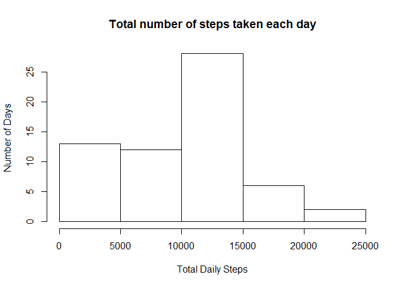
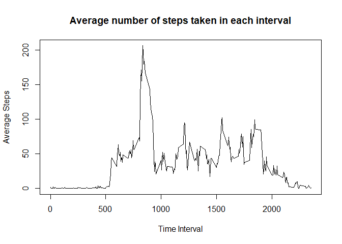
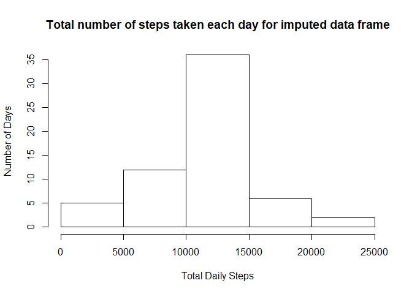
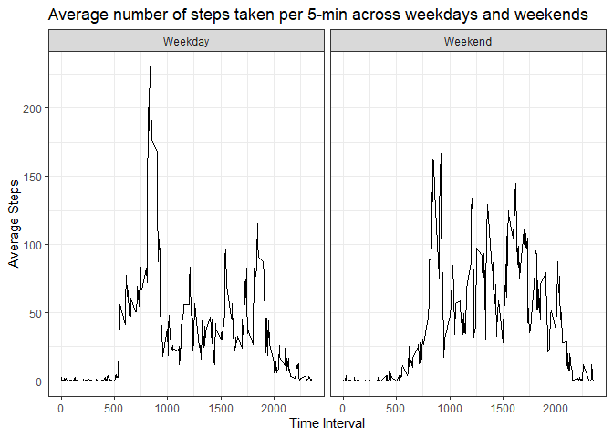

## Introduction

This assignment makes use of data from a personal activity monitoring device. This device collects data at 5 minute intervals through out the day. The data consists of two months of data from an anonymous individual collected during the months of October and November, 2012 and include the number of steps taken in 5 minute intervals each day.

The data for this assignment can be downloaded from the course web site: [Activity monitoring data](https://d396qusza40orc.cloudfront.net/repdata%2Fdata%2Factivity.zip)

The variables included in this dataset are:

+ steps: Number of steps taking in a 5-minute interval (missing values are coded as NA)
+ date: The date on which the measurement was taken in YYYY-MM-DD format
+ interval: Identifier for the 5-minute interval in which measurement was taken

The dataset is stored in a comma-separated-value (CSV) file and there are a total of 17,568 observations in this dataset

## Loading and preprocessing the data


Since the data is already provided in the github repository, I am not going to download the data again.


```r
## Unzip the activity data file & read the data
unzip("activity.zip")
actv <- read.csv("activity.csv", stringsAsFactors = FALSE)
```


```r
## Converting date from character to date format
actv$date <- as.Date(actv$date)
```

## What is mean total number of steps taken per day?


```r
## Calculate Total Steps in each day
## Ignoring the missing values in the activity data
actv_dly <- group_by(actv, date) %>% summarize(ttl_steps = sum(steps, na.rm = TRUE))

## Histogram of the total number of steps taken each day
hist(actv_dly$ttl_steps, xlab = "Total Daily Steps", ylab = "Number of Days",
     main = "Total number of steps taken each day")
```

<!-- -->


```r
## Calculate Mean and Median of steps taken each day
mean_actv_dly <- mean(actv_dly$ttl_steps)
median_actv_dly <- median(actv_dly$ttl_steps)
```

Mean of number of steps taken each day **9354.2295082**  
Median of number of steps taken each day **10395**

## What is the average daily activity pattern?


```r
## Calculate Average Steps in each interval
## Ignoring the missing values in the activity data
actv_intvl <- group_by(actv, interval) %>% summarize(avg_steps = mean(steps, na.rm = TRUE))

## Time Series plot
plot(actv_intvl$interval, actv_intvl$avg_steps, type = "l", xlab = "Time Interval", ylab = "Average Steps",
     main = "Average number of steps taken in each interval")
```

<!-- -->


```r
## Calculate 5-minute interval that, on average, contains the maximum number of steps
actv_intvl_max <- actv_intvl[actv_intvl$avg_steps==max(actv_intvl$avg_steps),1]
```

5-minute interval that, on average, contains the maximum number of steps is **835**

## Imputing missing values


```r
## Calculate total number of missing values
actv_na <- sum(is.na(actv$steps))
```

Total number of missing values are **2304**

Strategy used to impute missing values: **Mean for that 5-minute interval**


```r
## Create a new dataset that is equal to the original dataset but with the missing data filled in
new_actv <- merge(actv, actv_intvl, by = "interval")
new_actv[is.na(new_actv$steps),2] <- new_actv[is.na(new_actv$steps), 4]
new_actv <- new_actv[,1:3]
```


```r
## Calculate Total Steps in each day for imputed data frame
new_actv_dly <- group_by(new_actv, date) %>% summarize(ttl_steps = sum(steps))

## Histogram of the total number of steps taken each day for imputed data frame
hist(new_actv_dly$ttl_steps, xlab = "Total Daily Steps", ylab = "Number of Days",
     main = "Total number of steps taken each day for imputed data frame")
```

<!-- -->


```r
## Calculate Mean and Median of steps taken each day for imputed data frame
mean_new_actv_dly <- mean(new_actv_dly$ttl_steps)
median_new_actv_dly <- median(new_actv_dly$ttl_steps)
```

Mean of number of steps taken each day for imputed data frame **10766.19**  
Median of number of steps taken each day for imputed data frame **10766.19**

Impact of imputation, calculated as percentage increase in total daily steps, is **13.1** percent

## Are there differences in activity patterns between weekdays and weekends?


```r
## Create a new factor variable in the dataset with two levels – “weekday” and “weekend”
new_actv$wkdy <- weekdays(new_actv$date)
new_actv$is_wknd_flg <- new_actv$wkdy %in% c("Saturday","Sunday")
new_actv$dy_flg[new_actv$is_wknd_flg == TRUE] <- "Weekend"
new_actv$dy_flg[new_actv$is_wknd_flg == FALSE] <- "Weekday"
new_actv$dy_flg <- as.factor(new_actv$dy_flg)

## Calculate Average Steps in each interval for imputed data frame by factor variable
new_actv_intvl <- group_by(new_actv, interval, dy_flg) %>% summarize(avg_steps = mean(steps))

## Panel plot containing a time series plot of the 5-minute interval (x-axis) and the average number of steps taken
## averaged across all weekday days or weekend days (y-axis)
ggplot(data = new_actv_intvl, aes(interval, avg_steps)) + geom_line() + facet_grid(.~dy_flg) + xlab("Time Interval") + ylab("Average Steps") + ggtitle("Average number of steps taken per 5-min across weekdays and weekends") + theme_bw()
```

<!-- -->
